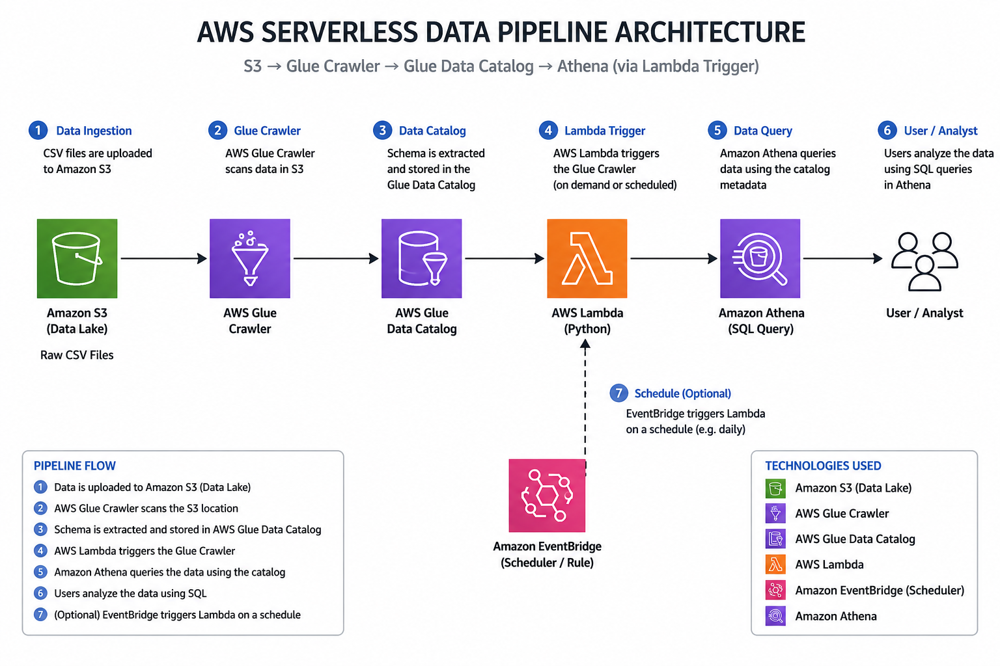

# 🚀 AWS Serverless Data Pipeline

[](https://aws.amazon.com/)
[](https://www.python.org/)
[](https://aws.amazon.com/athena/)
[](https://aws.amazon.com/glue/)
[](https://aws.amazon.com/lambda/)
[](https://aws.amazon.com/s3/)

## 📖 Project Overview

This project demonstrates how to build a serverless data pipeline on AWS.

When a CSV file is uploaded to Amazon S3, AWS Lambda automatically starts an AWS Glue Crawler to update the Glue Data Catalog. The data can then be queried using Amazon Athena without loading it into a traditional database.

This project showcases common AWS services used by Data Engineers to build scalable and serverless analytics solutions.

---

## 🏗️ Architecture

<p align="center">
  
</p>

---

## ⚙️ AWS Services Used

- Amazon S3
- AWS Lambda
- AWS Glue Crawler
- AWS Glue Data Catalog
- Amazon Athena
- AWS IAM

---

## 📂 Project Structure

```text
aws-serverless-data-pipeline/
│
├── architecture/
├── lambda/
├── sample-data/
├── screenshots/
├── sql/
└── README.md
```

---

## 🔄 Pipeline Workflow

1. Upload a CSV file to Amazon S3.
2. Amazon S3 triggers AWS Lambda.
3. Lambda starts the AWS Glue Crawler.
4. Glue updates the Data Catalog.
5. Amazon Athena queries the data using SQL.

---

## 💻 Sample SQL Queries

```sql
SELECT *
FROM raw
LIMIT 10;
```

```sql
SELECT COUNT(*)
FROM raw;
```

```sql
SELECT category,
SUM(price * quantity) AS total_sales
FROM raw
GROUP BY category;
```

---

## 📷 Screenshots

Project screenshots are available in the `screenshots` folder.

---

## 🎯 Learning Outcomes

- Build a serverless data pipeline
- Automate metadata updates with AWS Glue
- Query data stored in Amazon S3 using Athena
- Implement event-driven architectures with AWS Lambda
- Apply AWS IAM best practices

---

## 👨‍💻 Author

**Daniel Ruiz López**

AWS Data Engineer | AWS Cloud | SQL | Python | Amazon Athena | AWS Glue
